 
# How-To DAB (on SWA) using  AAD

_How-to mount DAB (Data API Builder) on SWA (Static Web Application) using AAD authentication wiht Azure Database_


### Targets / Idea:
1. Az SQL DB must be under firewall (no public IP)
2. Microsoft  DAB must use AAD authentication with Az SQL DB

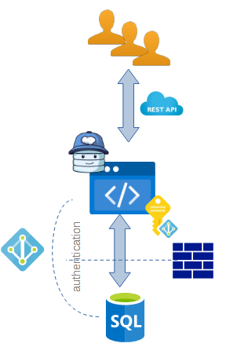

### Pre-requisite I: Prepare a SWA (Static Web Application)
1. Deploy a new SWA
   Reference: [Quickstart: Build your first static web app](https://github.com/staticwebdev/vanilla-basic/generate)
   
   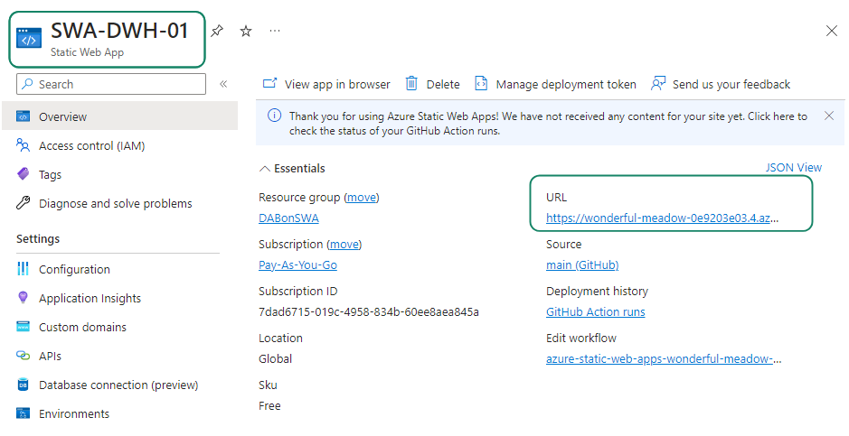
   
2. Test connectivity 

	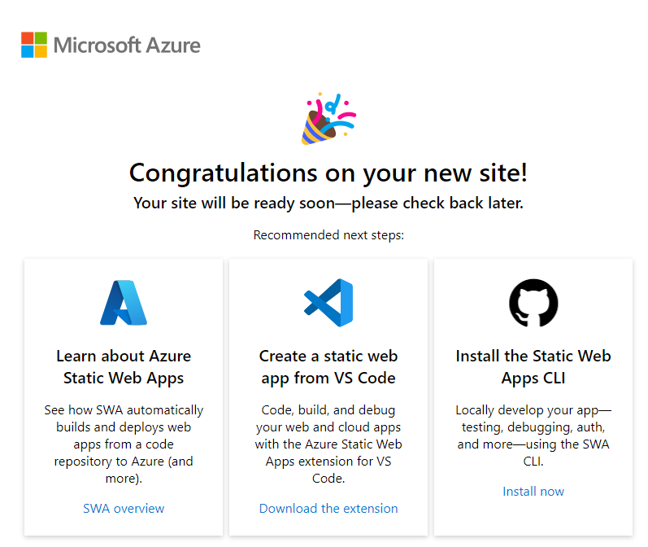


### Pre-requisite II: Prepare a Az SQL Database
1. Deploy a Az Database 

	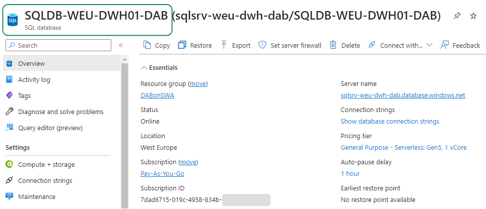

2. Be sure that is Integrated with AAD authentication

	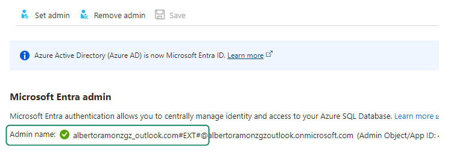

3. Be sure that is under Firewall (no public IP)

	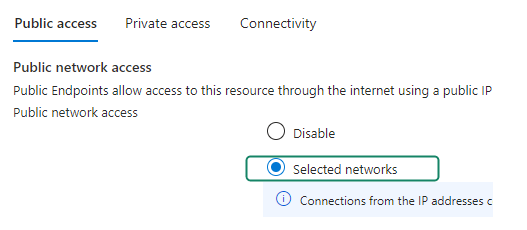

4. Test connectivity. 

   Very important that you access througth AAD authentication, and no SQL login / password:
   
	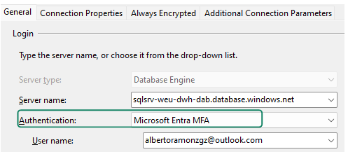
	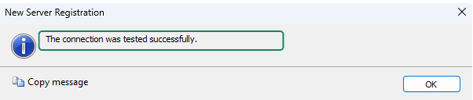
	
5. We need create tables and fill some data, you can use this script from DAB GitHub

   Run this [T-SQL Script](https://github.com/Azure/data-api-builder/blob/main/samples/getting-started/azure-sql-db/library.azure-sql.sql) (Optional: and later [This](https://github.com/Azure/data-api-builder/blob/main/samples/getting-started/azure-sql-db/exercise/exercise-library.azure-sql.sql))
   
	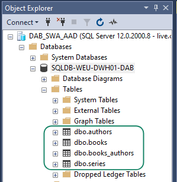

### Pre-requisite II: Install DAB CLI
To make more easy create the DAB config file, we can use use com DAB CLI commands to create a temmplate
1. Install DAB CLI:   REFERENCE: [What is Data API builder? - Install](https://learn.microsoft.com/en-us/azure/data-api-builder/overview-to-data-api-builder?tabs=azure-sql#installation)

   Require Microsoft .NET SDK 6.0 [Download](https://dotnet.microsoft.com/en-us/download) (v7 is no LTS and v8 is too new)
   
2. Test Install
	
   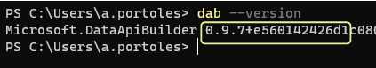


## How-To

### 1. How-To: Networking configuration
Because Az DB is doesn't have a public IP, we need interconnect DAB and Az DB using Private endpoints for both of them

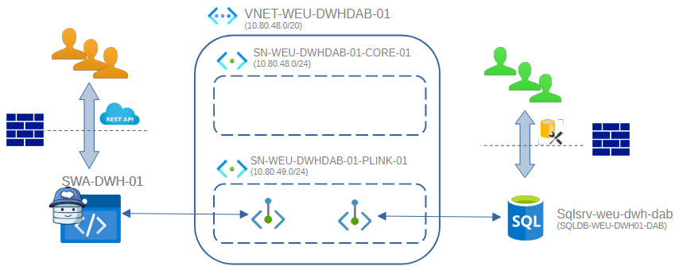

1. Create Endpoint for Az SQL DB:
   We will use the PLINK SNet for this purpose:
   
   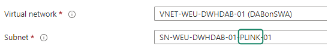
   
   In the SQL Server > Networking must appear as approved:
   
   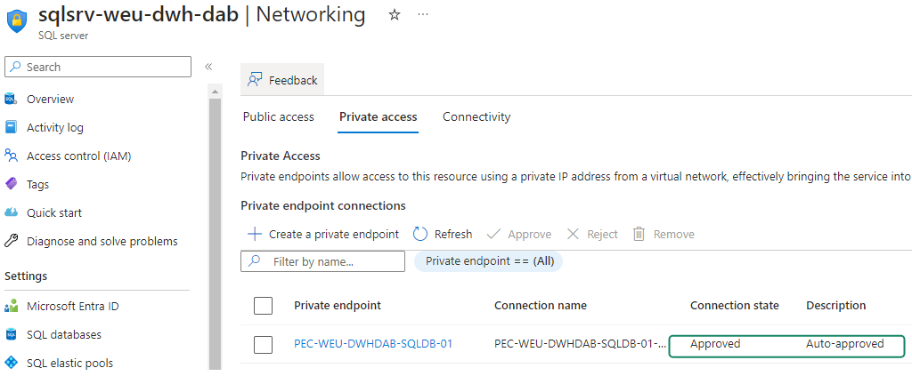
   

2. Create Endpoint for Az SWA:
	Use Private endpoint is not compatible with the Free plan
	REFERENCE: [Configure private endpoint in Azure Static Web Apps](https://learn.microsoft.com/en-us/azure/static-web-apps/private-endpoint)

   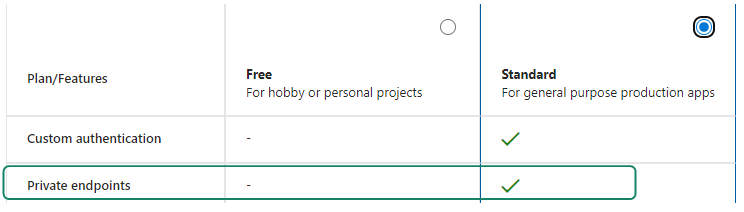
	
	If your SKU plan is free, you will need upgrade to Standard Plan:

   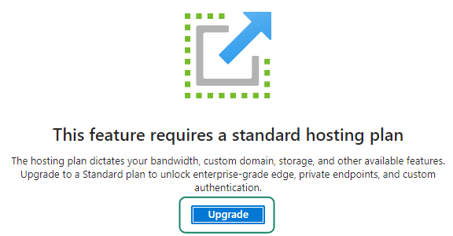
   
   Again, We will use the PLINK SNet for this purpose:
   
     
   
   In the SWA > Private Endpoints must appear as approved:
   
   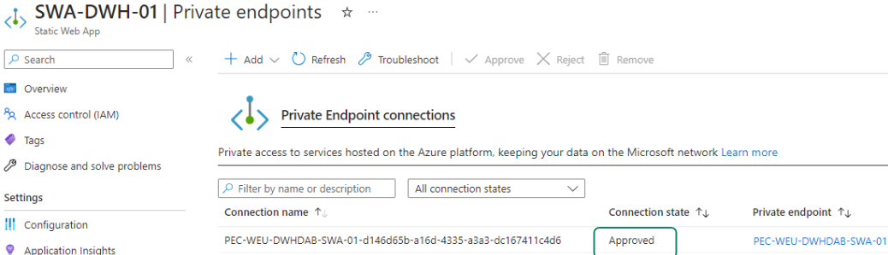

3. Check that both Private endpoints appear in the PLINK SNet:

   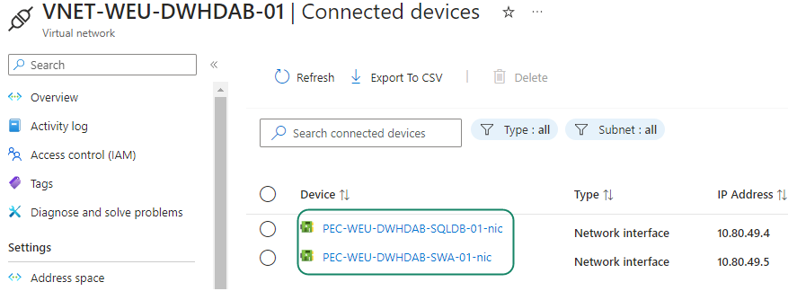
   
4. Check (again) SWA connectivity.
	By default when you activate SWA's Private Endpoints, only will be accesible using Private IP, thus you will see something like this:
	
   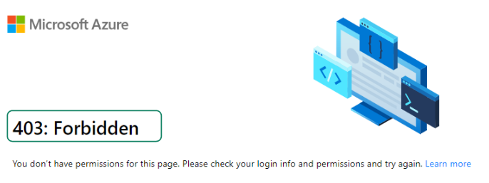	
   
   There are 2 solutions:
   
   * Use a VPN + Private DNS resolution
   * Create an Az VM, and connect to SWA using private IP (the DNS must be able to solve the name to the private DNS directly)

	You must see this:
	
	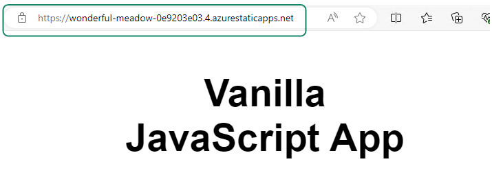	
 
 
### 2. How-To: Database Authentication  (System MI)

1. Enable System Management Identity on Az SWA
   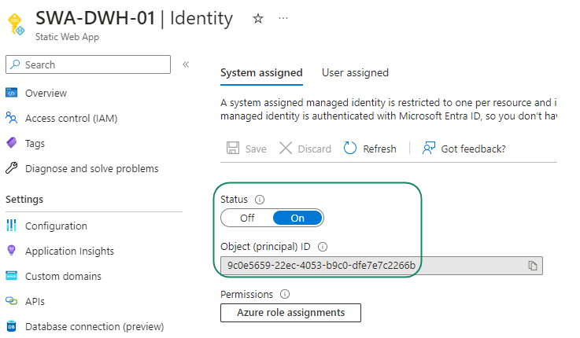	


2. Grant Read permission to SWA on Az SQL DB using T-SQL
```sql
--- Create an SQL user, that point the the System Managed Identity
-----------------------------------------------------------------
	CREATE USER [SWA-DWH-01] FROM EXTERNAL PROVIDER; 
	GO

--- Grant permissions to this SQL User
---   For now only Read at level access
-----------------------------------------------------------------
	ALTER ROLE [db_datareader] ADD MEMBER [SWA-DWH-01]; 
	GO
```


### 4. How-To: Check Networking configuration (Optional)
To check that the DB's private endpoint works and Database authentication with System management have sense, we can create an Azure VM in the same VNet that the Private Endpoints

   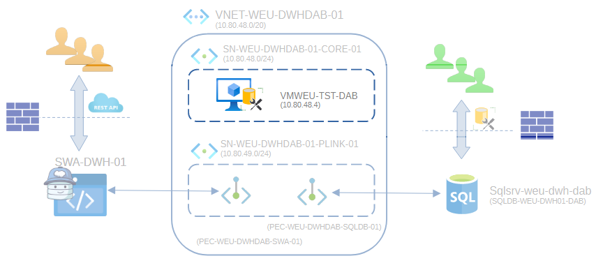

TIP: Is necesary access to this VM using AAD? No, but would be recomended for security reasons
REFERENCE: [Tutorial: Use a Windows VM system-assigned managed identity to access Azure SQL](https://learn.microsoft.com/en-us/entra/identity/managed-identities-azure-resources/tutorial-windows-vm-access-sql)

1. Create a VM and Install SSMS [Download](https://learn.microsoft.com/en-us/sql/ssms/download-sql-server-management-studio-ssms?view=sql-server-ver16#download-ssms)

  The VNet must be the same that contains the Private Enpoint of Az SWA and Az SQL DB:
  
  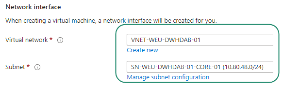

2. Enable System Manage Identity

  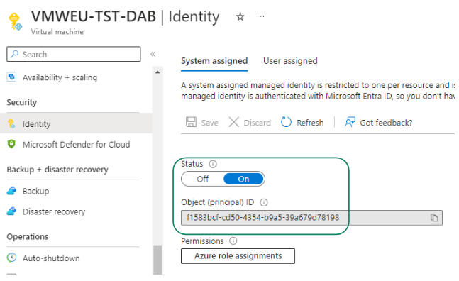
  
3. Run the same scripts that we run for Az SWA but for Az VM: 
```sql
--- Create an SQL user, that point the the System Managed Identity
-----------------------------------------------------------------
	CREATE USER [VMWEU-TST-DAB] FROM EXTERNAL PROVIDER; 
	GO

--- Grant permissions to this SQL User
---   For now only Read at level access
-----------------------------------------------------------------
	ALTER ROLE [db_datareader] ADD MEMBER [VMWEU-TST-DAB]; 
	GO
```

4. Connect from SSMS in the VM using Integrated AAD

  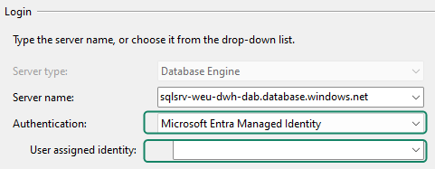
   * Use "Microsoft Entra Managed Identity"
   * Important: if "User Assigned Identity" is empty, thus SSMS will understand that must use **System** MI
   
   


### 5. How-To: DAB Configuration
REFERENCE: [Tutorial: Add an Azure SQL database connection in Azure Static Web Apps (preview)](https://learn.microsoft.com/en-us/azure/static-web-apps/database-azure-sql?tabs=bash&pivots=static-web-apps-rest#get-database-connection-string-for-local-development)

Now, yes . . . We are ready to play with Data API Builder !!

1. By default these names are fixed (/swa-db-connections/staticwebapp.database.config.json)
 
 ```bash
  swa db init --database-type mssql
 ```
   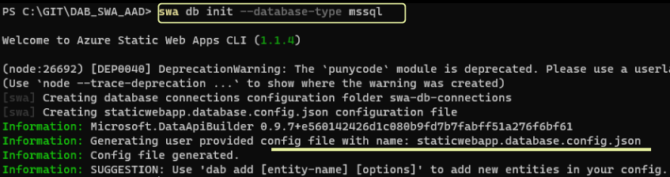
   
  This will create the Folder & File:
  
   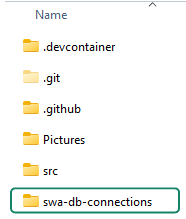
  


2. Add DAB objects using CLI.
(You can edit the JSON file manually too, but the CLI is a good to learn and provide a propper template that you can change later)

```bash
dab add Book -c "staticwebapp.database.config.json" --source dbo.books --permissions "anonymous:*"
```
   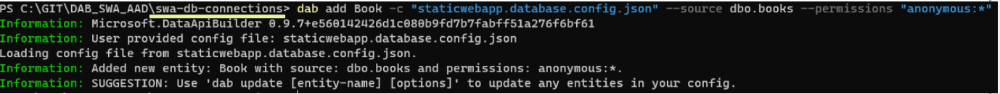
   
  The result file must be similar to this [V00.json](./JSON_Examples/V00.json)

3. Modify Connection String

  [Here](https://learn.microsoft.com/en-us/entra/identity/managed-identities-azure-resources/tutorial-windows-vm-access-sql#access-data) we have a sample ADO.NET with System Managed Identity
  
```bash
 "Data Source=<AZURE-SQL-SERVERNAME>; Initial Catalog=<DATABASE>; Authentication=Active Directory Managed Identity; Encrypt=True"
```  

In my case will be:
```bash
 "Data Source=sqlsrv-weu-dwh-dab.database.windows.net; Initial Catalog=SQLDB-WEU-DWH01-DAB; Authentication=Active Directory Managed Identity; Encrypt=True"
```  

   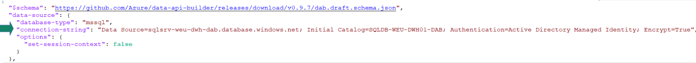
   
**Need pull the changes to GitHub, before run the next point**

   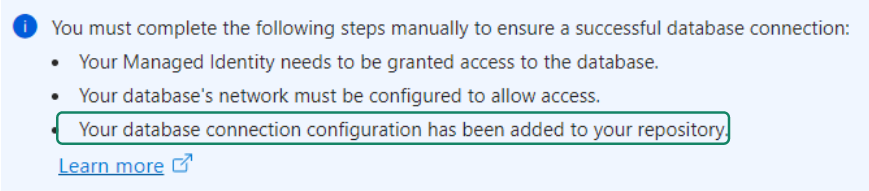

4. Configure SWA > Database connection 
   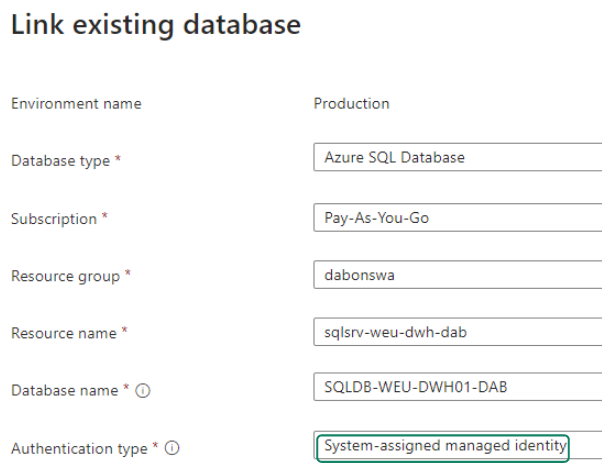

5. Test Rest API
In my case the URL is:

```bash 
https://wonderful-meadow-0e9203e03.4.azurestaticapps.net/data-api/Book
https://wonderful-meadow-0e9203e03.4.azurestaticapps.net/data-api/api/Book
```

**I have this error:**

   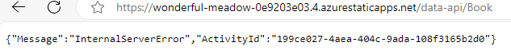


# Next Steps
* How-to integrate AAD authentication into DAB authentication
   This manual works with public API.
   
* Other way to grant SQL Permission to AWS. 
   There are 4 conbination splits in two groups
   * Use System Management Identity (System MI)
   * Use User Management Identity (User MI)