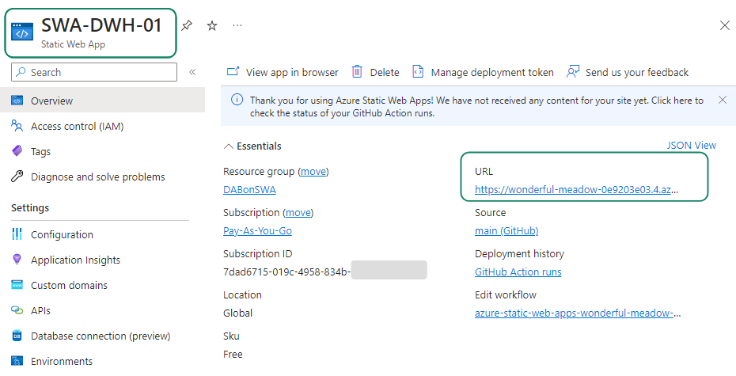

 
# How-To DAB (on SWA) using  AAD

_How-to mount DAB (Data API Builder) on SWA (Static Web Application) using AAD authentication wiht Azure Database_

### Targets / Idea:
1. Az SQL DB must be under firewall (no public IP)
2. Microsoft  DAB must use AAD authentication with Az SQL DB

### Pre-requisite I: Prepare a SWA (Static Web Application)
1. Deploy a new SWA
   Reference: [Quickstart: Build your first static web app](https://github.com/staticwebdev/vanilla-basic/generate)
   
   
   
2. Test connectivity 

	

### Pre-requisite II: Prepare a Az SQL Database
1. Deploy a Az Database 

	

2. Be sure that is Integrated with AAD authentication

	

3. Be sure that is under Firewall (no public IP)

	

4. Test connectivity. 

   Very important that you access througth AAD authentication, and no SQL login / password:
   
	
	
	
5. We need create tables and fill some data, you can use this script from DAB GitHub

   Run this [T-SQL Script](https://github.com/Azure/data-api-builder/blob/main/samples/getting-started/azure-sql-db/library.azure-sql.sql) (Optional: and later [This](https://github.com/Azure/data-api-builder/blob/main/samples/getting-started/azure-sql-db/exercise/exercise-library.azure-sql.sql))
   
	

### Pre-requisite II: Install DAB CLI
To make more easy create the DAB config file, we can use use com DAB CLI commands to create a temmplate
1. Install DAB CLI:   REFERENCE: [What is Data API builder? - Install](https://learn.microsoft.com/en-us/azure/data-api-builder/overview-to-data-api-builder?tabs=azure-sql#installation)

   Require Microsoft .NET SDK 6.0 [Download](https://dotnet.microsoft.com/en-us/download) (v7 is no LTS and v8 is too new)
   
2. Test Install
	
   

## How-To

### 1. How-To: Networking configuration
Because Az DB is doesn't have a public IP, we need interconnect DAB and Az DB using Private endpoints for both of them

1. Create Endpoint for Az SQL DB:
   We will use the PLINK SNet for this purpose:
   
   
   
   In the SQL Server > Networking must appear as approved:
   
   
   

2. Create Endpoint for Az SWA:
	Use Private endpoint is not compatible with the Free plan

   
	
	If your SKU plan is free, you will need upgrade to Standard Plan:

   
   
   Again, We will use the PLINK SNet for this purpose:
   
     
   
   In the SWA > Private Endpoints must appear as approved:
   
   

3. Check that both Private endpoints appear in the PLINK SNet:

   

### 2. How-To: Database Authentication
1. Enable System Management Identity in SWA

2. Grant Read permission to SWA on DB schema

### 3. How-To: Authentication (System MI)
We need Grant permissions to Az SWA on Az SQL DB tables

1. Enable System Managed Identity (System MI) on Az SWA 

2. Grant permission ussing T-SQL

### 4. How-To: Check Networking configuration (Optional)
To check that the DB's private endpoint works and Database authentication with System management have sense, we can create an Azure VM in the same VNet that the Private Endpoints

   

TIP: Is necesary access to this VM using AAD? No, but would be recomended for security reasons

1. Create a VM and Install SSMS [Download](https://learn.microsoft.com/en-us/sql/ssms/download-sql-server-management-studio-ssms?view=sql-server-ver16#download-ssms)

  The VNet must be the same that contains the Private Enpoint of Az SWA and Az SQL DB:
  
  

2. Enable System Manage Identity

  
  
3. Run the same scripts that we run for Az SWA but for Az VM: 

### 5. How-To: DAB Configuration
REFERENCE: [Tutorial: Add an Azure SQL database connection in Azure Static Web Apps (preview)](https://learn.microsoft.com/en-us/azure/static-web-apps/database-azure-sql?tabs=bash&pivots=static-web-apps-rest#get-database-connection-string-for-local-development)

1. Crate folder/config file. By default these names are fixed

2. Add DAB objects using CLI.
(You can edit the JSON file manually too, but the CLI is a good to learn and provide a propper template that you can change later)

3. Modify Connection String

4. Configure SWA / DB Connection 

5. Test Rest API

# Future
* How-to integrate AAD authentication into DAB authentication
   This manual works with public API.
   
* Other way to grant SQL Permission to AWS. 
   There are 4 conbination splits in two groups
   * Use System Management Identity (System MI)
   * Use User Management Identity (User MI)